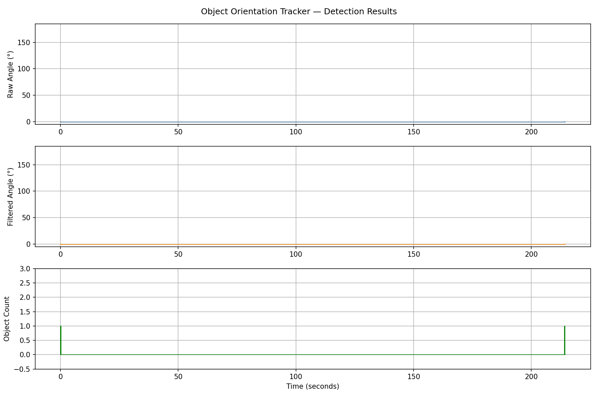
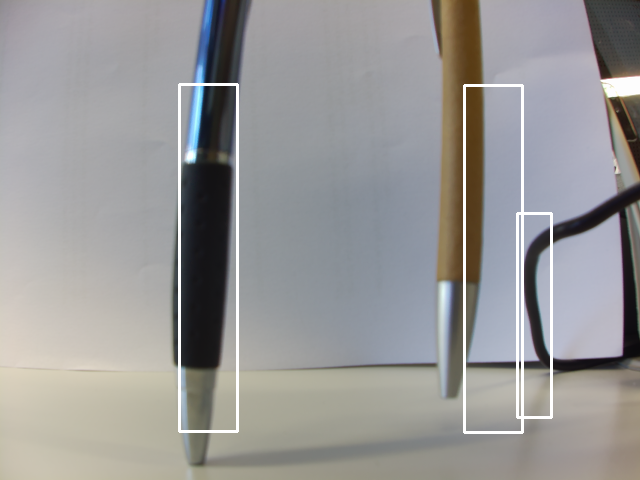
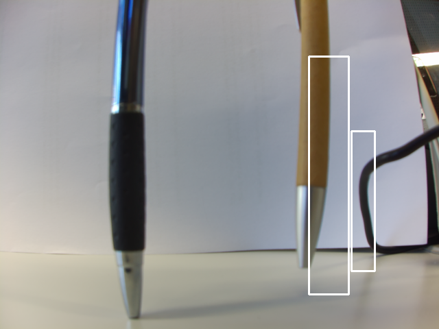
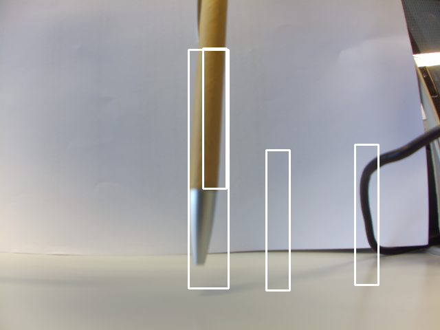

# RPi5 Object Orientation Tracker

Real-time object detection and orientation measurement on a Raspberry Pi 5.
Detects objects using a Haar cascade classifier, measures their angle using
Canny edge detection and Hough transform, smooths the output with a moving
average filter, and logs everything to CSV.

Built as a portfolio project extending work from the BiViP lab course
(Laborpraktikum Bild- und Videosignalverarbeitung auf eingebetteten Plattformen - Laboratory Practicum: Image and Video Signal Processing on Embedded Platforms)
at FAU Erlangen-Nürnberg.

---

## Hardware

- Raspberry Pi 5 (1GB)
- Raspberry Pi HQ Camera

Laptop mode is supported via `cv2.VideoCapture` - pass `--no-picamera` when running.
---

## How it works

1. Capture frame from Picamera2 (or video file on laptop)
2. Run Haar cascade classifier to detect objects
3. Crop ROI around detection, run Canny + Hough transform to get angle
4. Pass raw angle through a sliding window moving average filter (window=5)
5. Log timestamp, raw angle, filtered angle, object count to CSV

---

## How to run

**On laptop (testing mode):**
```bash
git clone https://github.com/VaibhavAher100/rpi-object-orientation-tracker
cd rpi-object-orientation-tracker
pip install -r requirements.txt
python src/detector.py --no-picamera
```

**On RPi5:**
```bash
git clone https://github.com/VaibhavAher100/rpi-object-orientation-tracker
cd rpi-object-orientation-tracker
pip install -r requirements-rpi.txt
# remove --no-picamera flag when running on RPi5
python src/detector.py
```

To visualise results after a run:
```bash
python src/visualize_results.py
```

---

## Project structure
```
src/
    detector.py            main loop -capture, detect, measure, log
    angle_filter.py        sliding window moving average using deque
    logger.py              append rows to CSV with auto-header
    visualize_results.py   plot angle trace from detections.csv

classifiers/
    pen_vertical_classifier.xml     trained for vertical pen detection
    haarcascade_frontalface_default.xml

results/
    angle_trace.png        sample output plot
    detection_sample_1.png best case detection
    detection_sample_2.png partial detection
    detection_sample_3.png worst case - multiple false positives
```

---

## Sample output



Object count panel shows detection events. Angle panels show raw and
filtered orientation in degrees. -1.0 means no object detected that frame.

### Detection frames from RPi5

| Best case | Partial detection | Worst case |
|-----------|------------------|------------|
|  |  |  |

The cable on the right edge is a known false positive source - the vertical
edge profile matches the pen classifier. Tuning `minNeighbors` reduces it.

---

## Known limitations

- Real pen angle data requires RPi5 with physical pens in frame. Laptop
  testing used a person video - the classifier fires occasionally on
  collar and jacket edges, giving 0.0 angle readings.
- Haar cascade can miss detections in low contrast or poor lighting.
  Tuning `scaleFactor` and `minNeighbors` in `detector.py` helps.
- Angle is measured for the first detected object per frame only. When multiple
  objects are present, `object_count` reflects the total detections but
  `raw_angle` and `filtered_angle` correspond to the first bounding box only.
  This is by design for simplicity - a multi-object tracker would require
  separate angle tracking per object ID.

---


## Performance (Raspberry Pi 5)

  The orientation tracker pipeline (Haar detection + Canny + Hough + filter + log)
  runs at 10 fps on Raspberry Pi 5 (1GB, no GPU) at 640×480 resolution,
  comfortably within a 100ms frame budget.